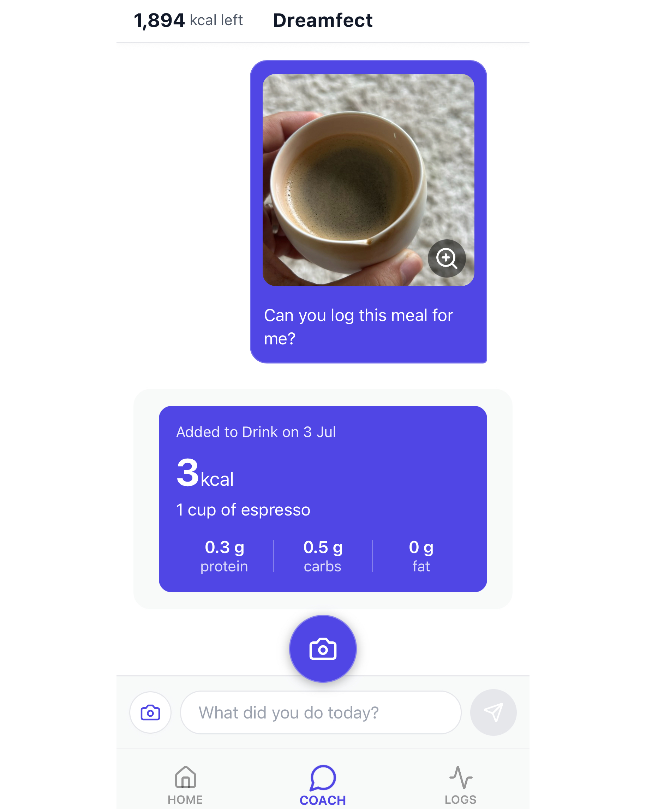

# Welcome to Dreamfect

**Dreamfect** is your all-in-one AI-powered coach that helps you eat better, move more, and stay on track with your health and life goals.

Whether you're tracking calories, logging workouts, or telling the app about your health situation, Dreamfect helps you take the next step — with empathy and intelligence.

> *Dreamfect isn't just about counting — it's about becoming.*

---

### 🌟 Key Features

- **🍽️ Smart Food Recognition**  
  Snap a photo of any meal and get instant nutritional analysis. Our AI recognizes thousands of foods and estimates portions automatically.
- **🔥 Exercise Tracking**  
  Capture your workouts effortlessly. Our AI identifies exercise types, duration, and intensity to calculate calories burned.
- **🧠 Intelligent Insights**  
  Get personalized recommendations, habit tracking, and progress insights powered by AI that learns your preferences and goals.
- **🎯 Goal Management**  
  Set and track health goals with precision. Our AI adapts recommendations based on your progress and lifestyle patterns.
- **📊 Progress Tracking**  
  Monitor your wellness journey with detailed analytics, trends, and achievements as you build healthier habits over time.
- **📚 Health Learning Insights**  
  Ask and receive bite-sized, contextual health education along the way — not just data, but understanding.

---

## 🤖 Your Dreamfect AI Coach

At the heart of Dreamfect is an **AI-powered coach** that continuously **analyzes your food and workout input** to compute:

- 🍽️ **What you’ve consumed** — calories, protein, carbs, fat  
- 🔥 **What you’ve burned** — through logged workouts and daily activity

<!--  -->
<!--  -->
<!-- 

  

  

    <button onclick="changeImage(-1)">←</button>
    <button onclick="changeImage(1)">→</button>
  

 -->

  
  

But it doesn't stop there.

Dreamfect’s coach understands **context** — not just numbers. When you let the app know how you're feeling — **injured**, **tired**, **energized**, or dealing with a condition like **high cholesterol** — the coach adapts its advice accordingly.

<!-- --- -->

### 🧠 Adaptive Intelligence in Action

Your AI coach responds to your real-life situations with smart, practical recommendations:
- **Feeling sore?** It may suggest active recovery or a stretching session.
- **Low on sleep?** It might recommend energy-boosting foods and lighter movement.
- **Have a health concern?** It factors in your goal (e.g., lower cholesterol) when recommending meals or workouts.

<!-- --- -->

### 🎯 More Than Tracking — It Guides You

Unlike rigid fitness apps, Dreamfect helps you make **better daily decisions**, even when life gets messy.

- Suggests **food swaps** based on your condition or goals  
- Encourages **balanced routines** and healthy habits  
- Learns from your behavior to offer **smarter suggestions** over time

<!-- --- -->

### 💬 Try Saying:
> “I’m recovering from an injury”  
> “I need to cut down on sugar”  
> “Help me get stronger”  
> “I didn’t sleep well last night”

Dreamfect listens — and helps you act on it.

---

### 💬 Try It Free

Dreamfect is available on the App Store.  
[Download now →](https://apps.apple.com/us/app/dreamfect/id1619744155)

---

Still curious? Dive into the rest of our docs!